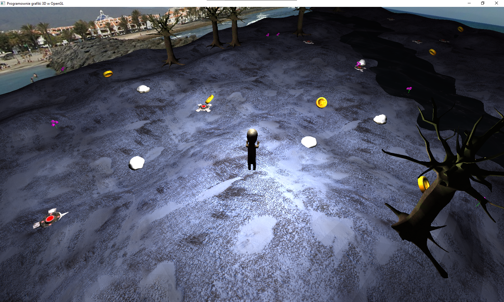

Poruszanie się WASD

Należy zebrać wszyskie monety aby skończyć grę

Na mapie są rozmieszczone przeszkody w postaci drzew, skał i min. Drzewa i skały zatrzymuja postać gracza a miny powodują chwilowe ogłuszenie w postaci rozmazanego ekranu i spowolnienia

Wszystkie obiekty są rozmieszczane na mapie losowo

Wyjście poza mape czy do rzeki jest niemożliwe

Za graczem podąża światło

Kamera jest ustawiona w trybie trzecioosobowym za postacią

